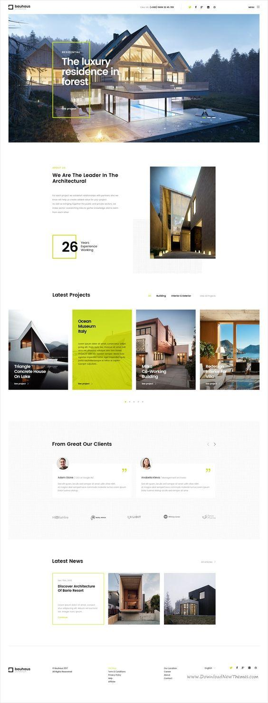

# Projet web ESIEA 2021
Professeur Anas CHAKROUN • [Sujet](https://docs.google.com/document/d/1lb-uMzLFX5j1SYizT4z8LypalpZee6FAmU3vZ4fvMnY/edit)

## État
**Terminé : [Site copié/rendu](https://rasp-al.com/web2021/)** - [Statistiques du projet](https://wakatime.com/@7115ac31-331a-4c74-8f9e-8d4b1c0bceab/projects/weijrrkmje?start=2021-05-04&end=2021-05-17)

## But
Copier la page donnée de manière responsive

> **Note pour le professeur : La responsivité ne sera pas assurée pour des largeurs < 260px !**

## Règles
- Remplacer le carrousel en haut par un carrousel plus simple
  - Flèches
  - Auto délai pour défiler
  - Description après délai
- Images libres
- Polices libres
- Texte libre
- **Pas de frameworks**

## Critères d'évaluation
- Qualité de reproduction
- Qualité de code
- Responsive
- Carrousel _fait en JS_

## Rendu
Lundi 17 mai 2021 -> Envoi du lien GitHub **par mail** à chakroun.anas.developer@gmail.com avec objet "`ESIEA S03 32 - [nom complet] - Evaluation programmation web`"

## Site à copier

